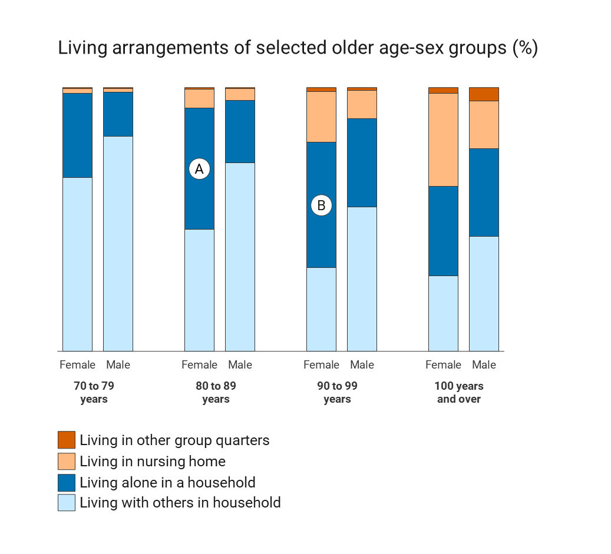

```{r setup, include=FALSE}
knitr::opts_chunk$set(echo = FALSE)
```

## Supplementary Materials

Additional materials for this paper are shared in the following GitHub repository: [https://github.com/kiegan/testing-charts-jds](https://github.com/kiegan/testing-charts-jds). The repository contains all data used in analyses, the original abstract submission file for SDSS 2023, and the code used to generate all figures and tables in the submission document. 

## Stimulus

```{r fig.cap="Image shown to participants for the task of comparing two unaligned rectangles in a vertical stacked barchart."}

```